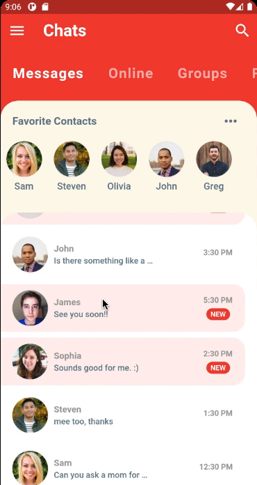
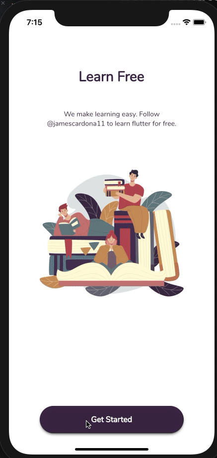
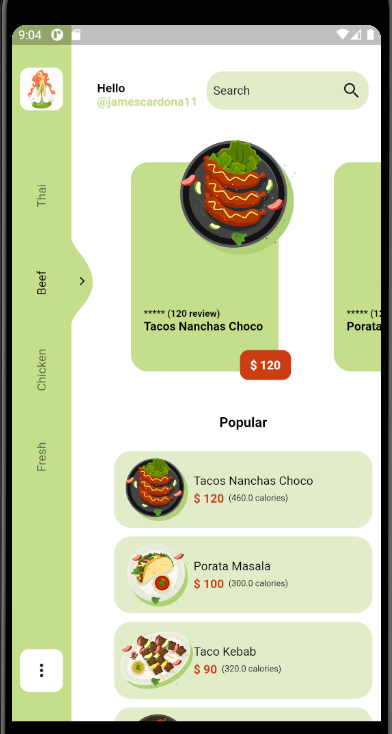
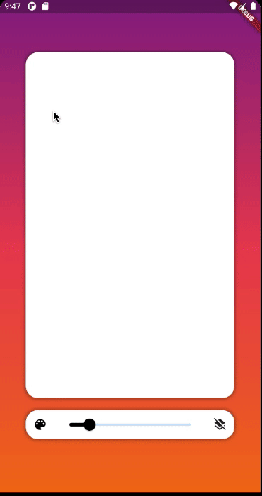

# UI CHALLENGES - Flutter :rocket:

In this repository I will post my progress, my idea is to create 100 different UI designs, we will see what the future holds for me.

## Motivation

The main motivation to start this project is to improve my flutter knowledge, at this moment I'm enthusiast and lover the flutter.
I'm a mobile developer from Colombia, my main knowledge is Android and Nodejs, at this moment I think flutter is a good opportunity for the future.

:arrow_forward:  Be free to like, give me a star, fork, and report issues.

## Favorites Flutter Widget
- Stack: [Fluter Api](https://api.flutter.dev/flutter/widgets/Stack-class.html)
- AnimatedBuilder  [Flutter Api](https://api.flutter.dev/flutter/widgets/AnimatedBuilder-class.html)

## Project

| Project #1  | Project #2 |
| :---        |    :----  |
| [Chat-UI](https://github.com/jamescardona11/ui-challenges/tree/master/chat_ui_flutter)      | [Login-UI](https://github.com/jamescardona11/ui-challenges/tree/master/login_animated_app)      |
|   |        |

| Project #3  | Project #4 |
| :---        |    :----  |
| [FoodDelivery](https://github.com/jamescardona11/ui-challenges/tree/master/food_delivery_app)      | [Drawing App](https://github.com/jamescardona11/ui-challenges/tree/master/custom_painting_app)    |
|   |      |