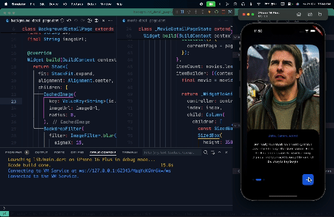
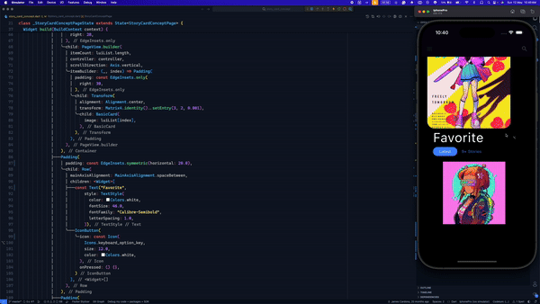
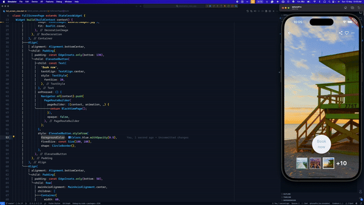
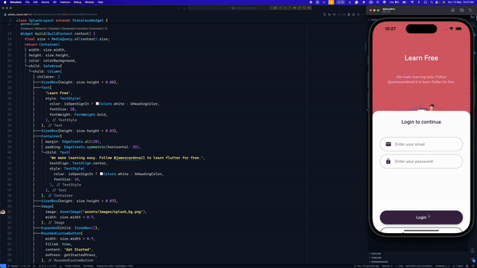
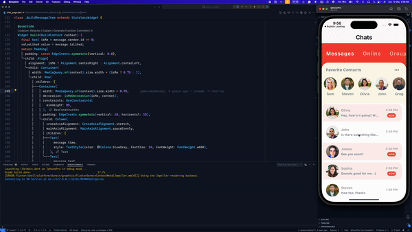
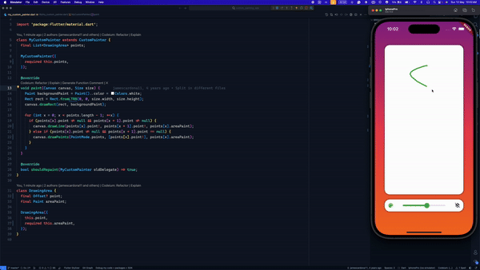
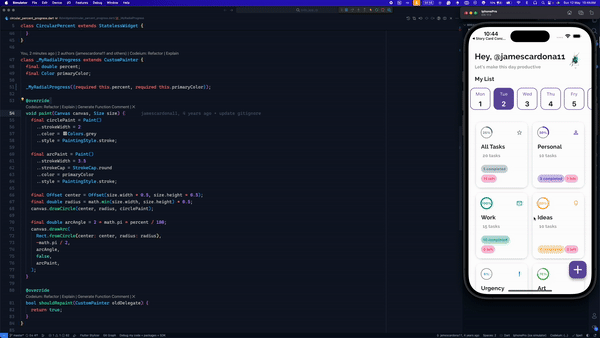
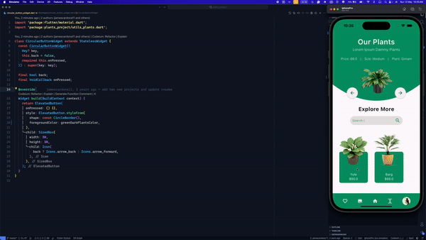
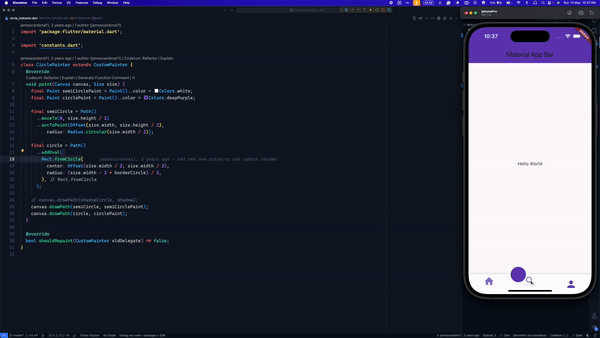
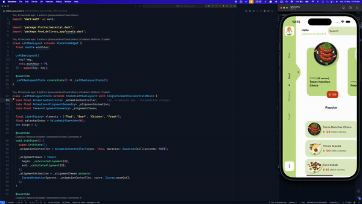

## Flutter examples

Here you can find some Flutter examples.

## Development Setup
Clone the repository and run the following commands:
```
flutter pub get
flutter run
```

## Screenshots

### [Movie App ][movies_app]
 

### [AR Social Intro][ar_social_intro]
 

### [ListCardAnimation][listCardAnimation]


### [BubbleLoading][bubbleLoading]


### [StoryCardConcept][storyCardConcept]


### [AwesomeCarouse][awesomeCarousel]


### [Destination Concept][destination]


### [LoginUI][loginui]


### [ChatUI][chatui]


### [Drawing App][drawingapp]


### [ToDo Page][todo]


### [Course Page][courseapp]


### [PlantsUI Page][plants]


### [Navigator Bar][simple_navigation_bar]


### [FoodDelivery][fooddelivery]



## Links

* [Website](https://jamescardona11.com)
* [Twitter](https://twitter.com/jamescardona11_)
* [LinkedIn](https://linkedin.com/in/jamescardona11)


[//]: #Projects
[chatui]: https://github.com/jamescardona11/flutter_ui_challenges/tree/master/chat_ui_flutter
[loginui]: https://github.com/jamescardona11/flutter_ui_challenges/tree/master/login_animated_app
[fooddelivery]: https://github.com/jamescardona11/flutter_ui_challenges/tree/master/food_delivery_app
[drawingapp]: https://github.com/jamescardona11/flutter_ui_challenges/tree/master/custom_painting_app
[todo]: https://github.com/jamescardona11/flutter_ui_challenges/tree/master/todo_app_rp
[courseapp]: https://github.com/jamescardona11/flutter_ui_challenges/tree/master/course_ui_app
[plants]: https://github.com/jamescardona11/flutter_ui_challenges/tree/master/plants_project
[destination]: https://github.com/jamescardona11/flutter_ui_challenges/tree/master/destination_view_app
[simple_navigation_bar]: https://github.com/jamescardona11/flutter_ui_challenges/tree/master/simple_navigation_bar
[ar_social_intro]: https://github.com/jamescardona11/flutter_ui_challenges/tree/master/ar_social_intro
[movies_app]: https://github.com/jamescardona11/flutter_ui_challenges/tree/master/movies_app

[awesomeCarousel]: https://github.com/jamescardona11/flutter_ui_challenges/tree/master/awesome_carousel
[bubbleLoading]: https://github.com/jamescardona11/flutter_ui_challenges/tree/master/bubble_loading
[fabMenu]: https://github.com/jamescardona11/flutter_ui_challenges/tree/master/fab_menu_challenge
[listCardAnimation]: https://github.com/jamescardona11/flutter_ui_challenges/tree/master/list_card_animation
[storyCardConcept]: https://github.com/jamescardona11/flutter_ui_challenges/tree/master/story_card_concept
