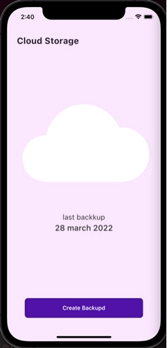
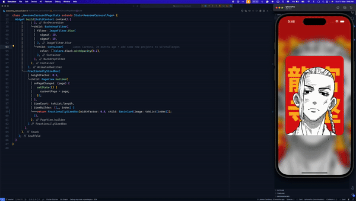

## Flutter examples

Here you can find some Flutter examples.

## Development Setup
Clone the repository and run the following commands:
```
flutter pub get
flutter run
```

## Screenshots

### AR Social Intro
  

### ListCardAnimation
 

### BubbleLoading


### StoryCardConcept
 

### AwesomeCarouse
 

### Destination Concept


### LoginUI
 

### ChatUI
  

### Drawing App 


### ToDo


### Course Page


### PlantsUI


### Navigator Bar


### FoodDelivery


## Links

* [Website](https://jamescardona11.com)
* [Twitter](https://twitter.com/jamescardona11_)
* [LinkedIn](https://linkedin.com/in/jamescardona11)
          

[//]: #Projects
[chatui]: https://github.com/jamescardona11/flutter_ui_challenges/tree/master/chat_ui_flutter
[loginui]: https://github.com/jamescardona11/flutter_ui_challenges/tree/master/login_animated_app
[fooddelivery]: https://github.com/jamescardona11/flutter_ui_challenges/tree/master/food_delivery_app
[drawingapp]: https://github.com/jamescardona11/flutter_ui_challenges/tree/master/custom_painting_app
[todo]: https://github.com/jamescardona11/flutter_ui_challenges/tree/master/todo_app_rp
[courseapp]: https://github.com/jamescardona11/flutter_ui_challenges/tree/master/course_ui_app
[plants]: https://github.com/jamescardona11/flutter_ui_challenges/tree/master/plants_project
[destination]: https://github.com/jamescardona11/flutter_ui_challenges/tree/master/destination_view_app
[simple_navigation_bar]: https://github.com/jamescardona11/flutter_ui_challenges/tree/master/simple_navigation_bar
[ar_social_intro]: https://github.com/jamescardona11/flutter_ui_challenges/tree/master/ar_social_intro


[awesomeCarousel]: https://github.com/jamescardona11/flutter_ui_challenges/tree/master/awesome_carousel
[bubbleLoading]: https://github.com/jamescardona11/flutter_ui_challenges/tree/master/bubble_loading
[fabMenu]: https://github.com/jamescardona11/flutter_ui_challenges/tree/master/fab_menu_challenge
[listCardAnimation]: https://github.com/jamescardona11/flutter_ui_challenges/tree/master/list_card_animation
[storyCardConcept]: https://github.com/jamescardona11/flutter_ui_challenges/tree/master/story_card_concept
