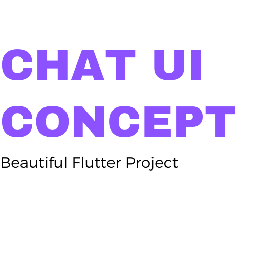

# Chat UI Concept - Flutter

##PROJECT #1

This project tries to create a UI similar to Dribbble-link, the result is a beautiful chat-ui design.

**UI Credit**
Design by: Ramotion [Dribbble Source](https://dribbble.com/shots/6428387-Messenger-Mobile-Concept)

This project is a part of the ui-challenges in my [Github](https://github.com/jamescardona11). Personal project to learn more about flutter exploring different widgets and multiples UI/UX.

# Preview
  
