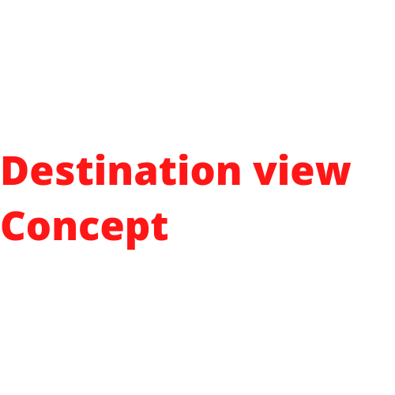
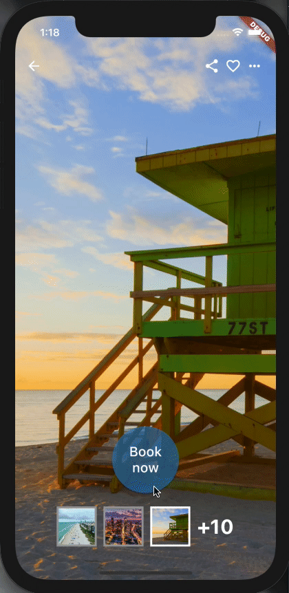

# Destination View concept - Flutter

## PROJECT #1

This project tries to create a UI similar to Dribbble-link, the result is a beautiful chat-ui design.

**UI Credit**
Design by: Amit Maheshwari [Linkedin Source](https://www.linkedin.com/feed/update/urn:li:activity:6927964673157787648/)

This project is a part of the ui-challenges in my [Github](https://github.com/jamescardona11). Personal project to learn more about flutter exploring different widgets and multiples UI/UX.

# Preview

 
